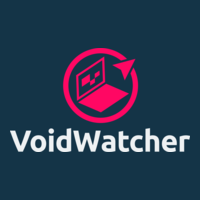

<p align="center">
  <a href="" rel="noopener">
 </a>
</p>

<h3 align="center">VoidWatcher</h3>

<div align="center">

[]()


[](/LICENSE)

 
 


</div>

---

<p align="center"> 
    A docker application to watch other containers logs for certain terms and report back to message server is one is found.
    <br> 
</p>

## 📝 Table of Contents

- [About](#about)
- [Getting Started](#getting_started)
- [Quick Start](#quick_start)
- [Usage](#usage)
- [TODO](/TODO.md#todo)
- [Authors](#authors)
- [Disclaimer](#disclaimer)

## 🧐 About <a name = "about"></a>

Some containers I ran provided only logs and no notification service was provided so I decided to create this application in order to add a notification service to these such programs. This allowed have allowed me to dabble my hands in creating a docker image that can be easily replicated and deployed on any machine.

## 🏁 Getting Started <a name = "getting_started"></a>

These instructions will get you a copy of the project up and running on your local machine for development and testing purposes. See [Quick Start](#quick_start) for notes on how to deploy the project on a live system.

### Quick Start

Use the example docker-compose.yml below to get started using.

```yml
services:
  voidwatcher:
    image: ladishdev/voidwatcher:latest
    container_name: voidwatcher
    environment:
      - CONTAINER_NAMES=my_container_1,my_container_2
      - my_container_1_TERMS=error,critical,failure      # Terms for container 1
      - my_container_2_TERMS=timeout,warning            # Terms for container 2
      - DISCORD_WEBHOOK_URL=https://discord.com/api/webhooks/your_webhook_url
      - GOTIFY_URL=http://your-gotify-url
      - GOTIFY_TOKEN=your_gotify_token
    volumes:
      - /var/run/docker.sock:/var/run/docker.sock
    restart: unless-stopped
```

The configuration above will need some changing based upon what you wish to monitor and the terms for it to look for. You are able to monitor a single container or multiple based upon your needs. Once configured run this command to get up and running.

```bash
docker compose up -d
```

## 🎈 Usage <a name="usage"></a>

Edit docker-compose.yml configuration to add container names and terms for the following specified ones that u wish to monitor. This application is scaleable to support as many and as little containers to monitor as needed.

Currently container names dont support hypens and therefore if being used should switch to using underscores or camelcase.

## ✍️ Authors <a name = "authors"></a>

- [@LadishDev](https://github.com/ladishdev) - Idea & Initial work

## ❗Disclaimer <a name = "disclaimer"></a>
### No Warranty

VOIDWATCHER IS PROVIDED "AS IS", WITHOUT WARRANTY OF ANY KIND, EXPRESS OR IMPLIED, INCLUDING BUT NOT LIMITED TO THE WARRANTIES OF MERCHANTABILITY, FITNESS FOR A PARTICULAR PURPOSE AND NONINFRINGEMENT. IN NO EVENT SHALL THE AUTHORS OR COPYRIGHT HOLDERS BE LIABLE FOR ANY CLAIM, DAMAGES OR OTHER LIABILITY, WHETHER IN AN ACTION OF CONTRACT, TORT OR OTHERWISE, ARISING FROM, OUT OF OR IN CONNECTION WITH THE SOFTWARE OR THE USE OR OTHER DEALINGS IN THE SOFTWARE.
